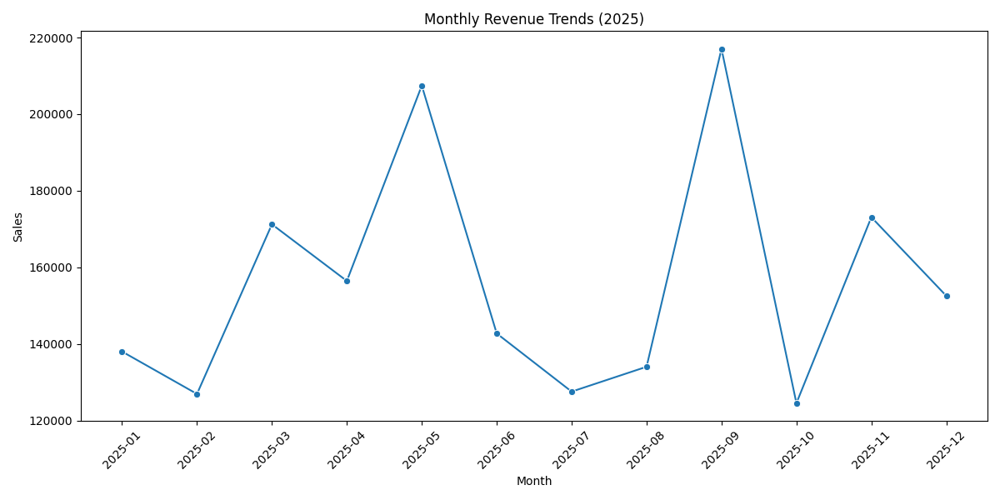
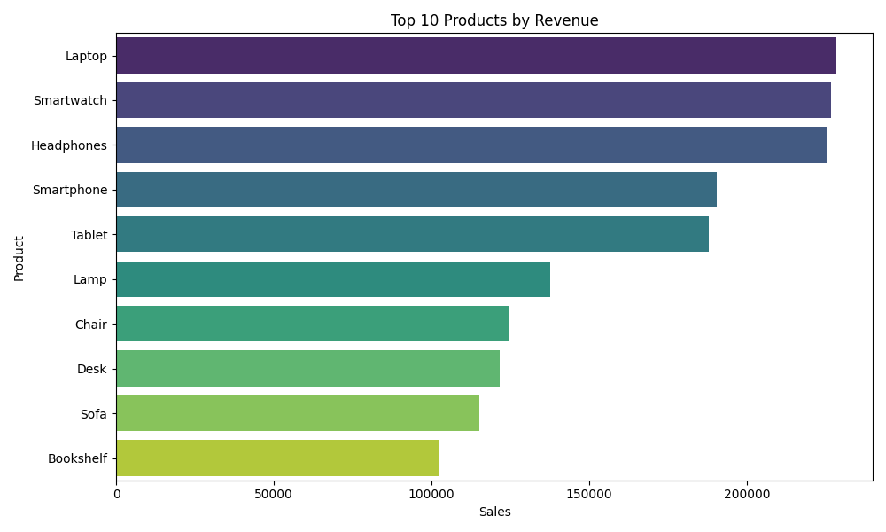
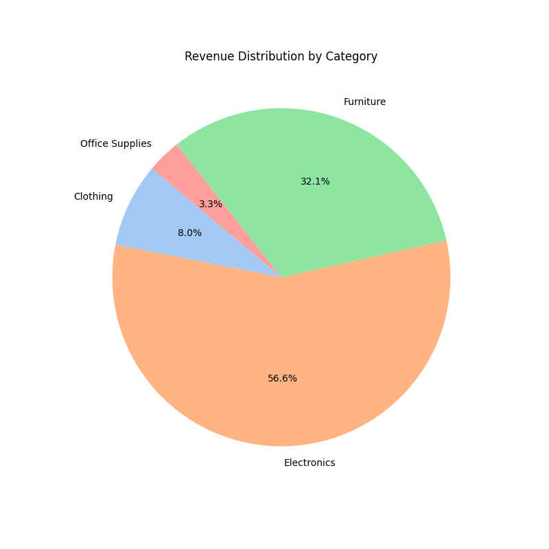
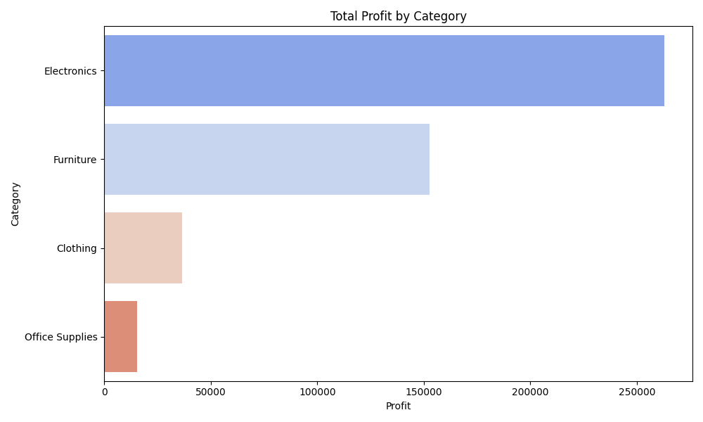
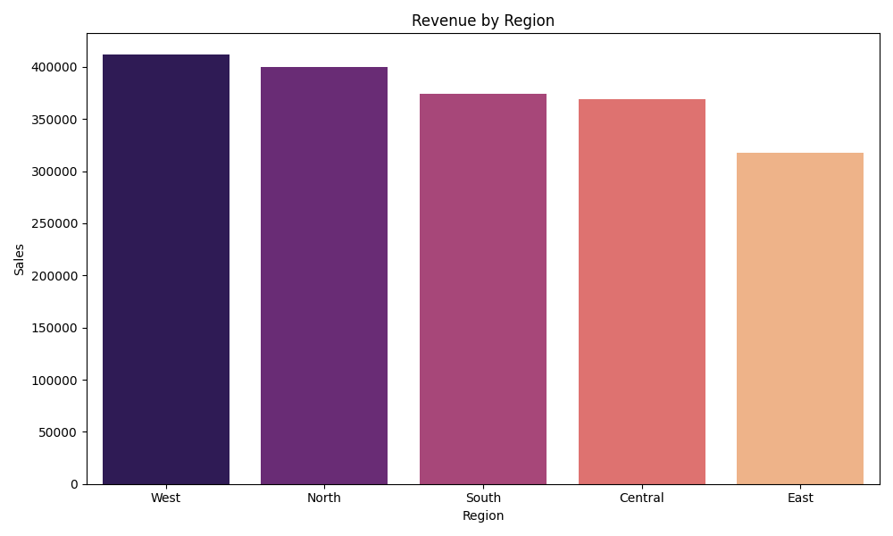

# Business Sales Performance Analytics Report

## Executive Summary
This report analyzes business sales data for the year 2025. The analysis covers revenue trends, product performance, category distribution, and regional insights to provide actionable recommendations for business growth.

### Key Performance Indicators (KPIs)
- **Total Revenue:** $1,871,575.13
- **Total Profit:** $467,285.87
- **Total Units Sold:** 5,523
- **Average Order Value:** $1,871.58
- **Top Performing Category:** Electronics
- **Top Performing Region:** West

---

## 1. Revenue Trends
The monthly revenue trends show the business's performance over time.

*Insight:* Revenue fluctuates throughout the year, with specific peaks indicating seasonal demand or successful marketing campaigns.

## 2. Product Performance
Identifying the top-selling products helps in inventory management and focused marketing.

*Insight:* The top 10 products contribute significantly to the total revenue. High-value electronics like Laptops and Smartphones are the primary drivers.

## 3. Category Analysis
Understanding the contribution of each category to the overall revenue and profit.

### Revenue Distribution

### Profit by Category

*Insight:* **Electronics** is the highest revenue generator, while other categories like **Furniture** and **Clothing** show steady performance but lower profit margins compared to high-end electronics.

## 4. Regional Performance
Geographic analysis helps in identifying strong markets and areas for expansion.

*Insight:* The **West** region is the top performer in terms of sales revenue, followed closely by other regions. The relatively balanced distribution suggests a strong national presence.

---

## Actionable Recommendations

1. **Focus on High-Margin Products:** Increase marketing spend on Electronics, particularly Laptops and Smartphones, as they drive the bulk of revenue and profit.
2. **Regional Expansion:** While the West is leading, the Central and South regions show potential for growth. Targeted local promotions could boost performance in these areas.
3. **Seasonal Promotions:** Analyze the dips in the monthly revenue chart to implement "Off-Season" sales or loyalty programs to stabilize cash flow.
4. **Inventory Optimization:** Ensure high stock levels for the top 10 products to avoid stockouts and capitalize on demand.
5. **Cross-Category Bundling:** Bundle lower-selling Office Supplies or Clothing items with high-value Electronics to increase the Average Order Value.

---
*Report generated on: 2026-04-25*
